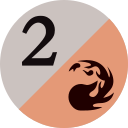
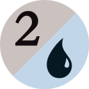
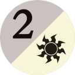
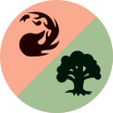
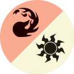
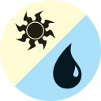

# Magic: The Gathering Emoji

Slack-ready 128x128 PNG's.

| Emoji | Name |
|---|---|
|  | :mtg_x: |
|  | :mtg_tap: |
|  | :mtg_colorless: |
|  | :mtg_s: |
| | |
|  | :mtg_0: |
|  | :mtg_1: |
|  | :mtg_2: |
|  | :mtg_3: |
|  | :mtg_4: |
|  | :mtg_5: |
|  | :mtg_6: |
|  | :mtg_7: |
|  | :mtg_8: |
|  | :mtg_9: |
|  | :mtg_10: |
|  | :mtg_11: |
|  | :mtg_12: |
|  | :mtg_13: |
|  | :mtg_14: |
|  | :mtg_15: |
|  | :mtg_16: |
|  | :mtg_17: |
|  | :mtg_18: |
|  | :mtg_19: |
|  | :mtg_20: |
| | |
|  | :mtg_2b: |
|  | :mtg_2g: |
|  | :mtg_2r: |
|  | :mtg_2u: |
|  | :mtg_2w: |
|  | :mtg_bg: |
| | |
|  | :mtg_black: |
|  | :mtg_blue: |
|  | :mtg_green: |
|  | :mtg_red: |
|  | :mtg_white: |
| | |
|  | :mtg_bp: |
|  | :mtg_gp: |
|  | :mtg_rp: |
|  | :mtg_up: |
|  | :mtg_wp: |
| | |
|  | :mtg_br: |
|  | :mtg_gu: |
|  | :mtg_gw: |
|  | :mtg_rg: |
|  | :mtg_rw: |
|  | :mtg_ub: |
|  | :mtg_ur: |
|  | :mtg_wb: |
|  | :mtg_wu: |

## Source

<http://mtgsalvation.gamepedia.com/Category:Mana_symbols>

## Disclaimer

Content is available under [CC BY-NC-SA 2.5](https://creativecommons.org/licenses/by-nc-sa/2.5/) unless otherwise noted. 
Magic: The Gathering content and materials are trademarks and copyrights of Wizards of the Coast its licensors. All rights reserved. @rstacruz is not affiliated with Wizards of the Coast.
